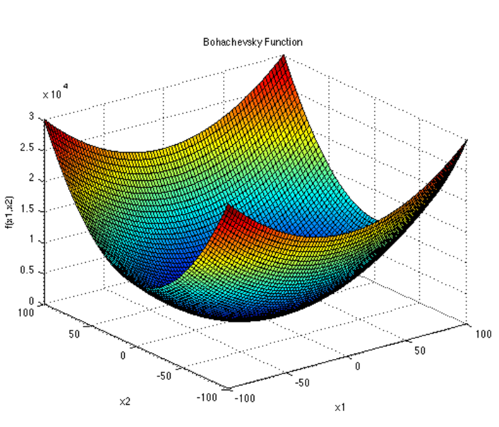
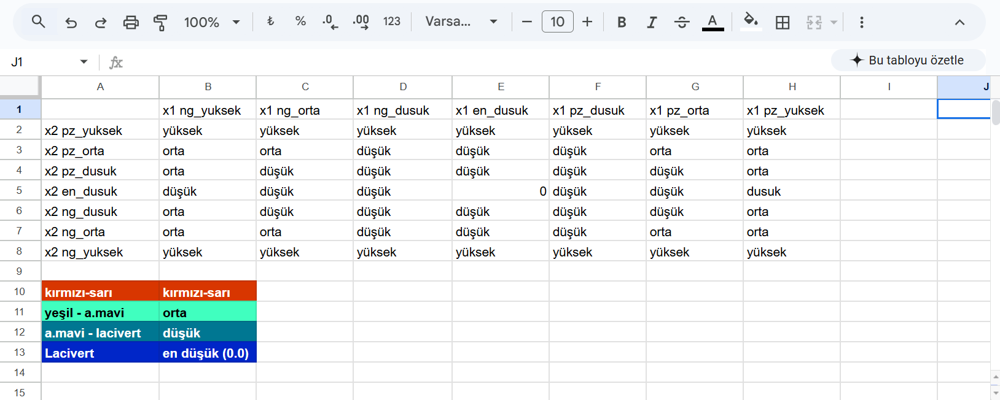
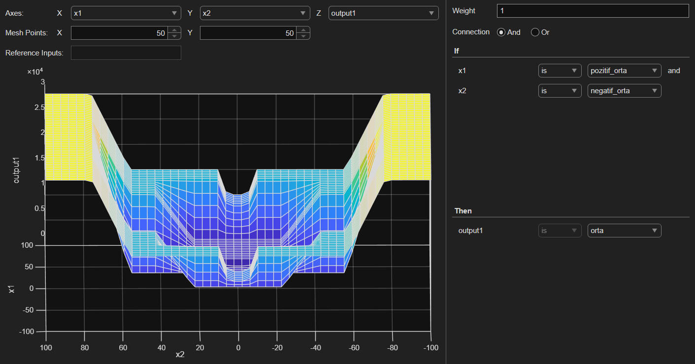
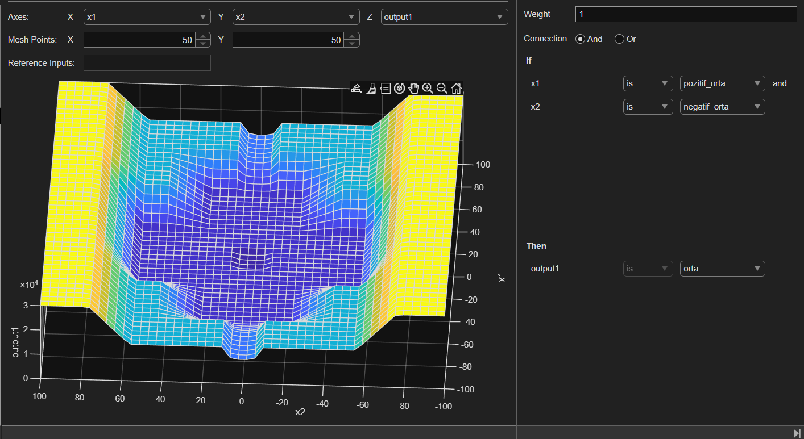
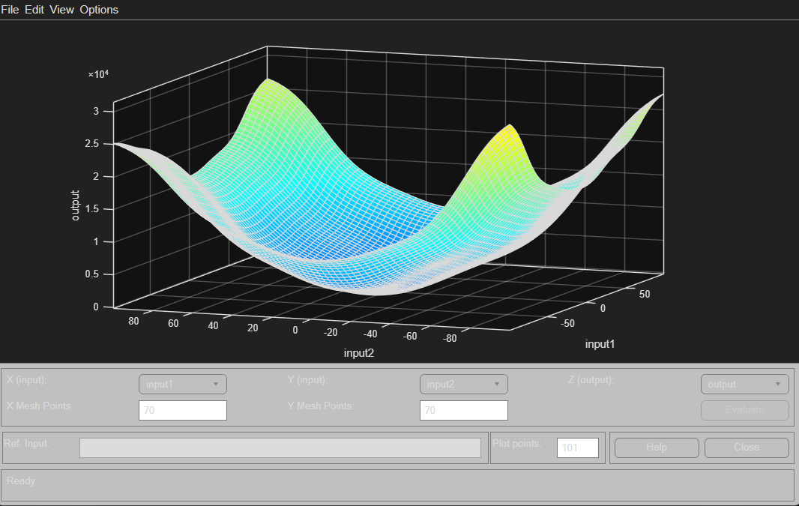
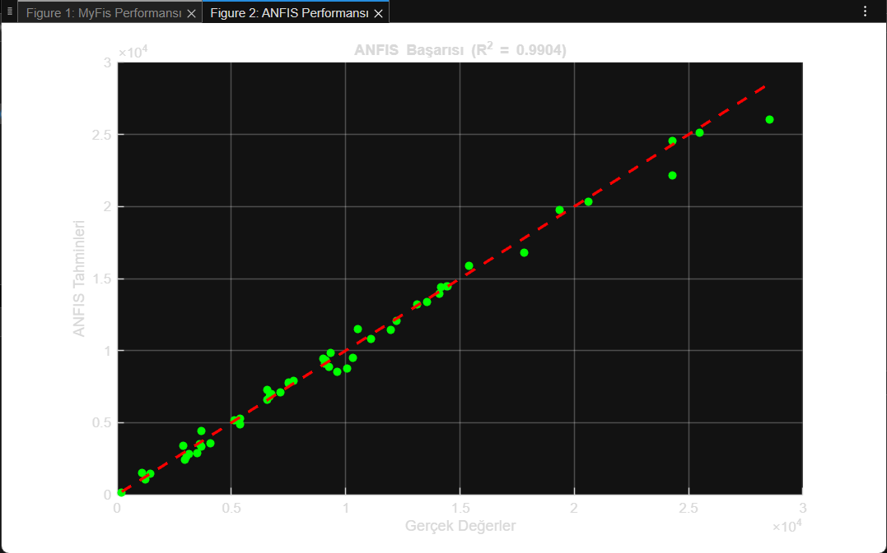
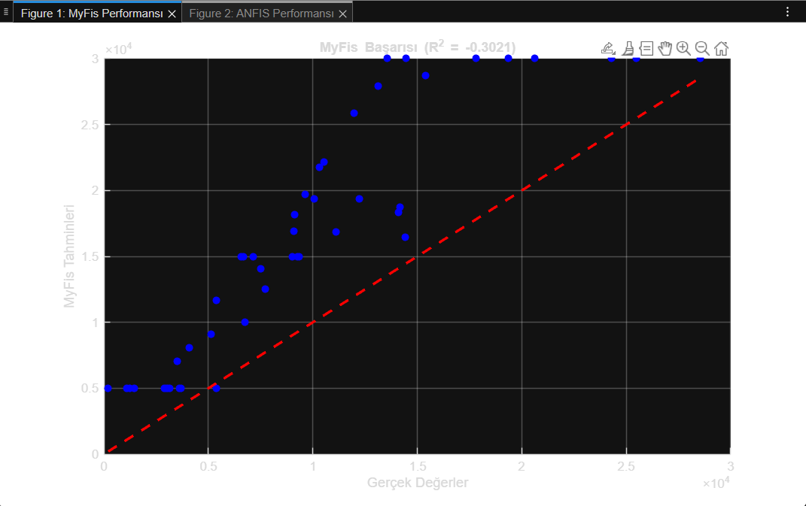

# ANFIS ile Bulanık Sistem Tasarımı ve Optimizasyonu

Bu projede, bir bulanık çıkarım sistemi iki farklı yaklaşımla modellenmiştir:
uzman bilgisine dayalı olarak elle tasarlanan bir bulanık sistem ve
veri odaklı öğrenme kullanan ANFIS (Adaptive Neuro-Fuzzy Inference System) modeli.

Çalışmanın amacı, klasik uzman tabanlı bulanık sistemlerin tasarım sürecinde
karşılaşılan zorlukları göstermek ve ANFIS yaklaşımının bu süreci nasıl daha
verimli, tutarlı ve hataya daha az açık hale getirdiğini ortaya koymaktır.

Modelleme problemi olarak doğrusal olmayan yapısı nedeniyle
**Bohachevsky fonksiyonu** kullanılmıştır.

---

## Problem Tanımı

Bohachevsky fonksiyonu, [-100, 100] aralığında tanımlı,
iki girişli ve karmaşık yüzey yapısına sahip bir test fonksiyonudur.
Bu özellikleri sayesinde bulanık sistemlerin modelleme başarımını
incelemek için uygun bir referans problem sunmaktadır.

Bu çalışmada amaç, söz konusu fonksiyonu yaklaşık olarak modelleyebilen
iki farklı bulanık sistem yaklaşımını karşılaştırmaktır.





---

## Uzman Tabanlı Bulanık Sistem Tasarımı

Çalışmanın ilk aşamasında, Sugeno tipi bir bulanık çıkarım sistemi
uzman bilgisine dayalı olarak manuel şekilde tasarlanmıştır.
Her bir giriş değişkeni için yedi adet trapezoidal üyelik fonksiyonu
tanımlanmış ve toplamda 49 adet kural oluşturulmuştur.



Bu yaklaşım, kural ve üyelik fonksiyonlarının tamamen insan yorumu ile
belirlenmesi nedeniyle tasarım karmaşıklığını ve hataya açıklığı
net bir şekilde ortaya koymaktadır.

<p align="center">
  
  
</p>


---

## ANFIS Tabanlı Sistem Tasarımı

İkinci aşamada, aynı problem bu kez ANFIS yaklaşımı kullanılarak modellenmiştir.
Bu yöntemde, bulanık kurallar ve üyelik fonksiyonu parametreleri
veri üzerinden öğrenilerek otomatik olarak optimize edilmiştir.

Eğitim ve test veri setleri, tanımlanan giriş aralığında oluşturulmuş
ve model belirli sayıda epoch boyunca eğitilmiştir.
ANFIS sayesinde, manuel kural tanımlama ihtiyacı büyük ölçüde ortadan kalkmıştır.



---


---

## Sonuçlar ve Karşılaştırma

Elde edilen modellerin genelleme başarımını ölçmek amacıyla,
eğitimde kullanılmayan test verileri ile performans değerlendirmesi yapılmıştır.
Model çıktıları, gerçek fonksiyon değerleri ile karşılaştırılarak
tahmin doğruluğu incelenmiştir.

Elde edilen sonuçlar, ANFIS tabanlı sistemin:
- Daha düşük hata oranına sahip olduğunu
- Daha düzgün ve gerçekçi bir yüzey modeli ürettiğini
- Uzman tabanlı sisteme kıyasla daha tutarlı sonuçlar verdiğini
göstermektedir.

Uzman bilgisine dayalı sistemlerde, kural tanımlarının karmaşıklığı
ve insan kaynaklı belirsizlikler performansı olumsuz etkileyebilmektedir.

<p align="center">
  
  
</p>


---


## Proje Yapısı


```
fuzzy_system_comparison/
│
├── expert_fis/                  # Expert-based FIS implementation
│   ├── expert_fis.m             # MATLAB script for expert FIS
│   └── expert_fis_rules.txt      # Rule base definition
│
├── anfis_model/                 # ANFIS implementation
│   ├── anfis_training.m         # MATLAB script for ANFIS training
│   └── anfis_results/            # Training results and plots
│
├── data/                        # Dataset generation and management
│   ├── generate_data.m          # Script to create training/test data
│   └── dataset.mat              # Generated dataset
│
├── evaluation/                  # Performance evaluation scripts
│   ├── evaluate_models.m        # Comparison script
│   └── results/                 # Evaluation plots and metrics
│
└── README.md                    # Project documentation
```

## Arka Plan

Bu çalışma, başlangıçta akademik bir ders kapsamında ele alınmış;
daha sonra kişisel bir çalışma olarak yeniden düzenlenmiş,
sadeleştirilmiş ve karşılaştırmalı analiz odaklı hale getirilmiştir.

---

## Kullanılan Araçlar

- MATLAB
- Fuzzy Logic Toolbox
- Neuro-Fuzzy (ANFIS) Designer

---

## Sonuç

Bu proje, veri tabanlı öğrenme kullanan ANFIS yaklaşımının,
klasik uzman tabanlı bulanık sistemlere kıyasla daha ölçeklenebilir,
daha tutarlı ve daha verimli bir çözüm sunduğunu göstermektedir.

## English Summary

This project presents a comparative study between an expert-designed fuzzy inference system
and an Adaptive Neuro-Fuzzy Inference System (ANFIS).
The Bohachevsky function is used as a benchmark problem to evaluate modeling performance.

The results show that the ANFIS-based approach significantly reduces human bias,
achieves lower prediction error, and provides a smoother and more consistent surface
approximation compared to the manually designed fuzzy system.

